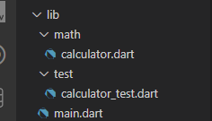
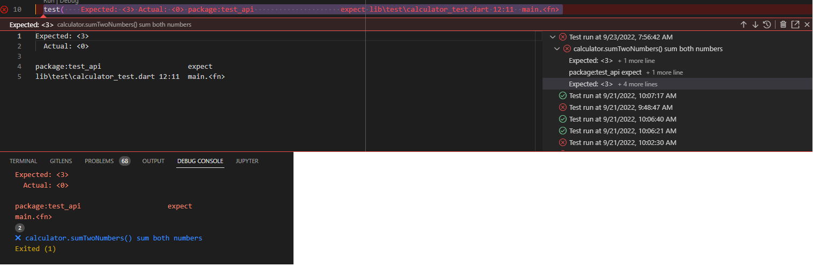

# #35 | Unit Testing Bagian 1 (TSA 2022)
## Tujuan Pembelajaran

* Mampu menerapkan Unit Testing menggunakan Test Package
* Mampu menerapkan Unit Test Mocking menggunakan Mockito


## Unit Testing Menggunakan Test Package

1. Install Dependensi Dart Test Package: https://pub.dev/packages/test

2. Buat program dart sederhana sebagai bahan unit testing. Contoh program sederhana: lib/math/calculator.dart

    

    di dalam file calculator.dart di folder math

    ```dart
    class Calculator {
      int add(int a, int b) {
        return 0;
      }
    }
    ```
    
3. Membuat Unit Testing

    Buat file baru di folder test dengan nama calculator_test.dart

   

    ```dart
    import 'package:test/test.dart';
    import '../math/calculator.dart';

        void main() {
        late Calculator _calculator;
        setUp(() {
            _calculator = Calculator();
        });

        test(
            'calculator.sumTwoNumbers() sum both numbers',
            () => expect(_calculator.sumTwoNumbers(1, 2), 3),
        );
        }
    ```

    Bedah Test Package:
    * Dalam unit testing yang dibuat, digunakan fungsi-fungsi utama dari plugin Test Package meliputi setUp(), test(), dan expect()
    * setUp() memanggil fungsi yang akan dieksekusi dimana akan dipanggil pada saat pengujian
    * test() melakukan pengujian pada fungsi yang telah dideklarasikan dan hasilnya akan ditampilkan
    * expect() mendeklarasikan keluaran yang diharapkan dari hasil pengujian. Dari contoh sebelumnya, diharapkan dengan parameter a = 1 dan b =2 akan memberikan hasil 3.

4. Eksekusi Unit Testing

    Hasil dari eksekusi unit testing mengatakan bahwa pengujian failed, karena hasilnya tidak sesuai harapan.

    Running Test dan Running Dart

    

5. Pembahasan Hasil Unit Testing


    


