# #35 | Unit Testing Bagian 1 (TSA 2022)
## Tujuan Pembelajaran

* Mampu menerapkan Unit Testing menggunakan Test Package
* Mampu menerapkan Unit Test Mocking menggunakan Mockito


## Unit Testing Menggunakan Test Package

1. Install Dependensi Dart Test Package: https://pub.dev/packages/test

2. Buat program dart sederhana sebagai bahan unit testing. Contoh program sederhana: lib/math/calculator.dart

    

    math/calculator.dart

    ```dart
    class Calculator {
      int add(int a, int b) {
        return 0;
      }
    }
    ```
    
3. Membuat Unit Testing

    Buat file baru di folder test dengan nama calculator_test.dart

   

    ```dart
    import 'package:test/test.dart';
    import '../math/calculator.dart';

        void main() {
        late Calculator _calculator;
        setUp(() {
            _calculator = Calculator();
        });

        test(
            'calculator.sumTwoNumbers() sum both numbers',
            () => expect(_calculator.sumTwoNumbers(1, 2), 3),
        );
        }
    ```

    Bedah Test Package:
    * Dalam unit testing yang dibuat, digunakan fungsi-fungsi utama dari plugin Test Package meliputi setUp(), test(), dan expect()

    * setUp() memanggil fungsi yang akan dieksekusi dimana akan dipanggil pada saat pengujian

    * test() melakukan pengujian pada fungsi yang telah dideklarasikan dan hasilnya akan ditampilkan

    * expect() mendeklarasikan keluaran yang diharapkan dari hasil pengujian. Dari contoh sebelumnya, diharapkan dengan parameter a = 1 dan b =2 akan memberikan hasil 3.

4. Eksekusi Unit Testing

    Hasil dari eksekusi unit testing mengatakan bahwa pengujian failed, karena hasilnya tidak sesuai harapan.

    Running Test

    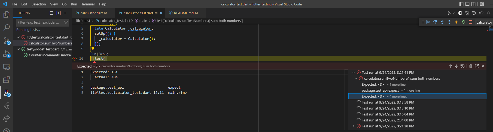

    Running Dart

    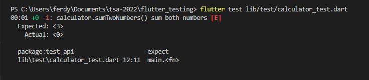

5. Pembahasan Hasil Unit Testing

    Terdapat empat kunci informasi:
    * 00:00 +0 -1: …. (E) berarti eksekusi program dalam waktu 0 detik dengan hasil 0 test lolos (+0) dan 1 test gagal (-1)

    * Pengujian gagal ada pada fungsi calculator.sumTwoNumbers() sum both numbers

    * Pengujian gagal karena pada statement expect() mengharapkan hasil nilai berupa 3 tapi yang dihasilkan 0

    * Pengujian gagal pada calculator_test.dart baris 12 dimana statement expect() didefinisikan

6. Perbaikan Kode

    * Berdasarkan hasil gagal dalam pengujian harus dilakukan identifikasi apa penyebabnya dan memulai untuk melakukan pembenahan bug yang ditemukan.

    * Sehingga lakukan pembenahan pada kode fungsi calculator.dart

    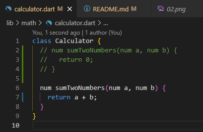

7. Unit Testing Perbaikan Kode
    * Lakukan unit testing kembali pada file test yang sama yaitu test/calculator_test.dart

    * Hasil running test

    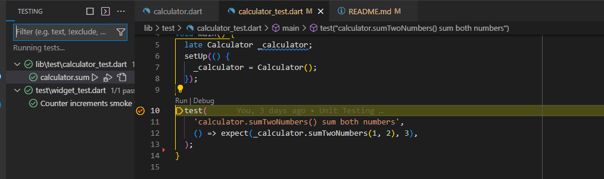

    * Hasil running dart

    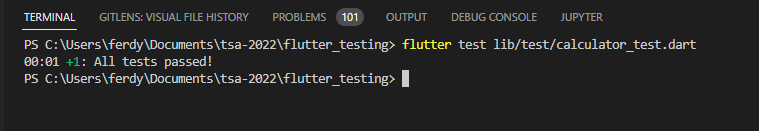

8. Pembahasan Hasil Unit Testing Perbaikan Kode

    * Pengujian lolos karena fungsi berhasil menghasilkan nilai kembalian sesuai expect() yang bernilai 3.

    * Dengan kode return a + b pada perbaikan kode secara sederhana memberikan nilai kembalian 3 ketika variabel a berisikan nilai 1 dan variabel b berisikan nilai 2.

    * Pengujian juga bisa dilakukan dengan membuat sekumpulan pengujian yang dieksekusi secara bersamaan 

9. Membuat Group Unit Testing

    *  Buat unit test untuk menguji program math/calculator.dart dengan mengimpelementasikan sekumpulan unit testing pada file calculator_test.dart

    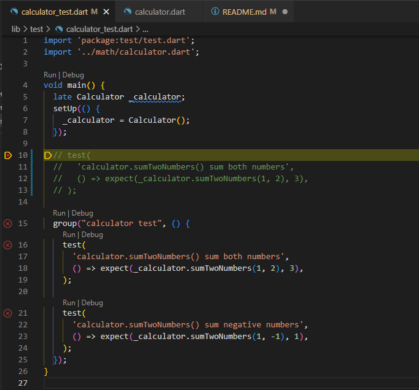

10. Group Unit Testing

    * Perbedaan hanya pada penggunaan metode group() dimana pada metode group() terdapat lebih dari satu statement test()

    * Pada contoh sebelumnya, dipanggil metode group() dengan dua parameter meliputi nama group (“calculator test”) dan sebuah fungsi anonymous yang menjalankan dua statement test() (“()”)

    * Fungsi anonymous tersebut memanggil dua statement test meliputi “sumTwoNumbers() sum both numbers” dan “sumTwoNumbers() sum negative numbe”

11. Eksekusi Group Unit Testing

    Running Test

    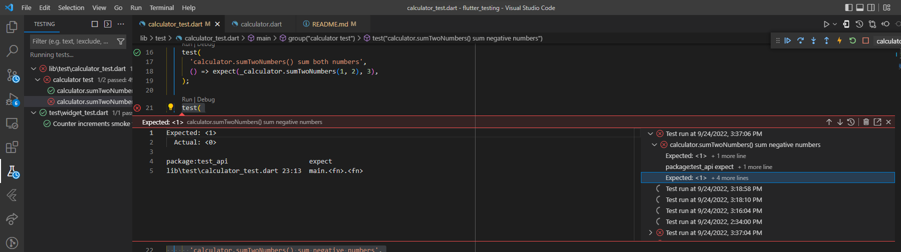

    Running Dart

    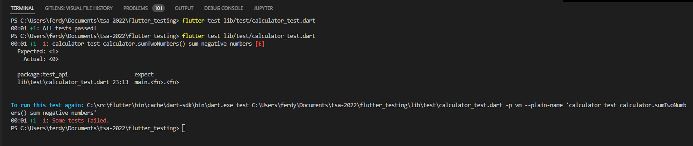

    * Hasilnya terdapat 1 pengujian lolos dan 1 pengujian gagal. Hal ini dikarenakan statement expect() salah pada line 22 dimana 1 + (-1) diharapkan hasilnya 1

12. Perbaikan Group Unit Testing 

    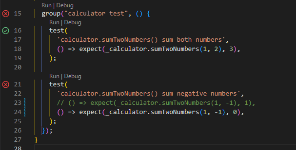

13. Eksekusi Group Unit Testing Perbaikan

    Running Test

    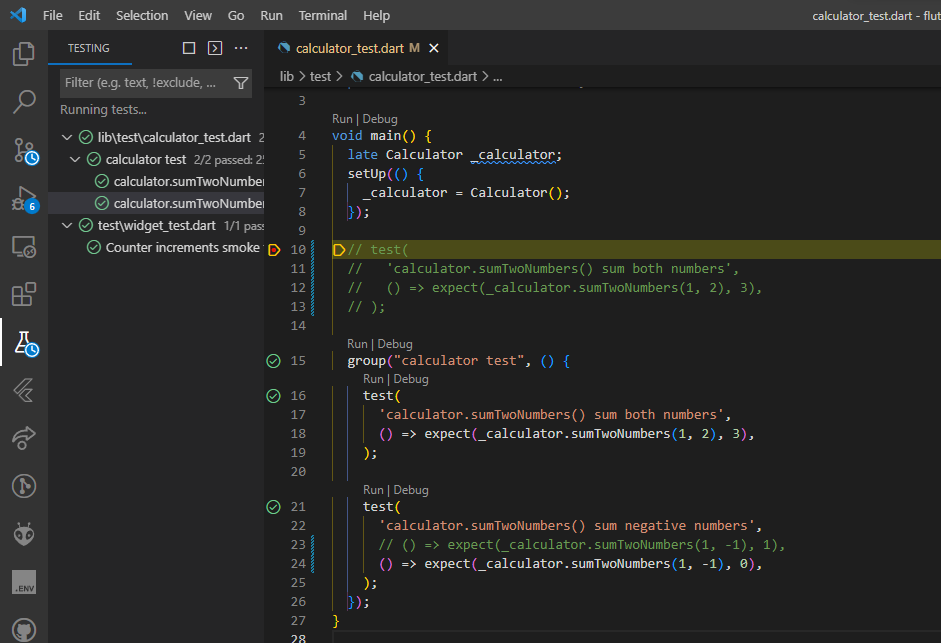

    Running Dart

    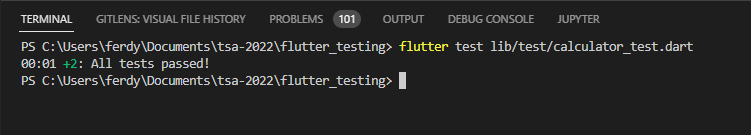

    * Hasilnya terdapat 2 pengujian lolos dan 0 pengujian gagal. Hal ini dikarenakan statement expect() pada line 22 dan 23 sudah sesuai dengan hasil yang diharapkan.

    

    


