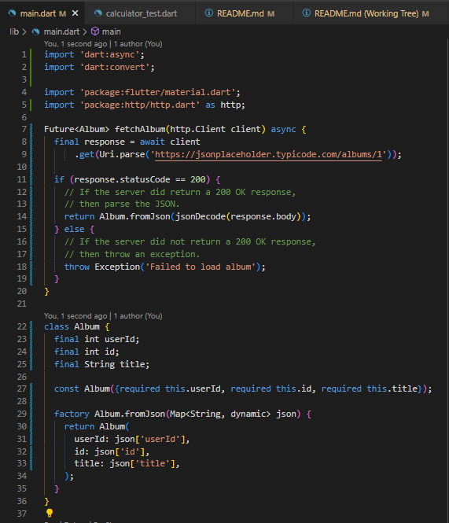
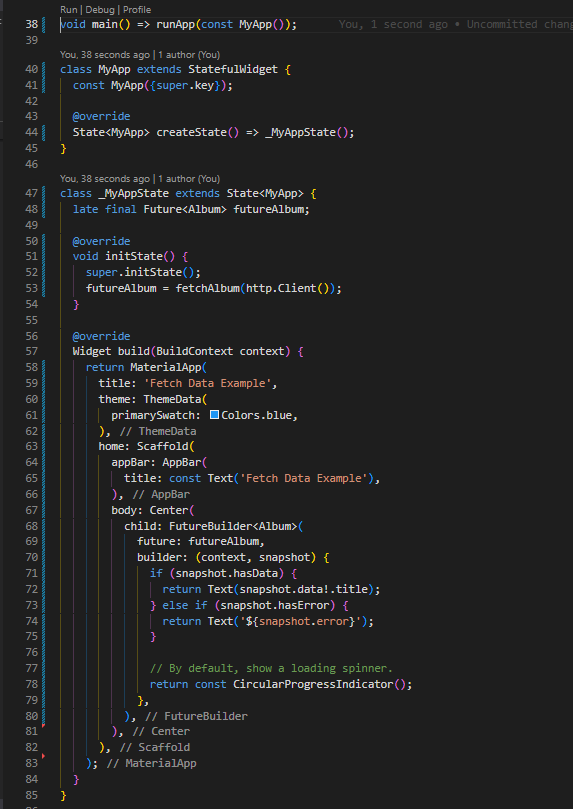
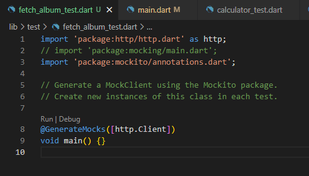
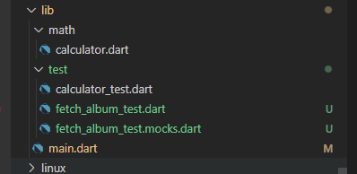
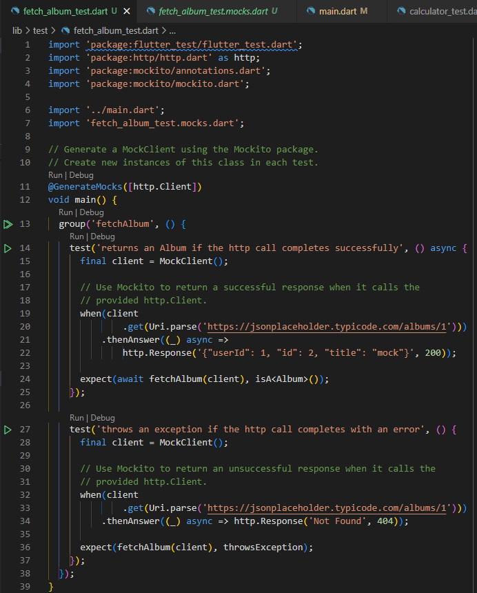
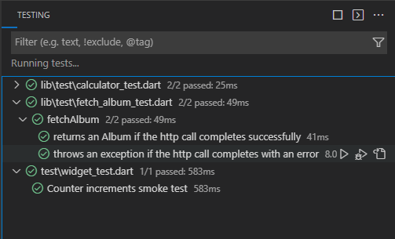
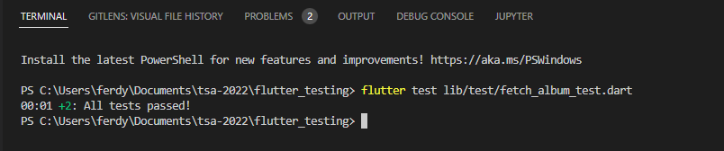

# #36 | Unit Testing Bagian 1 (TSA 2022)

Unit testing digunakan untuk mengetes apakah sebuah function/method/class itu memenuhi kriteria yang sudah ditetapkan atau tidak.

## Tujuan Pembelajaran

* Mampu menerapkan Unit Testing menggunakan Test Package
* Mampu menerapkan Unit Test Mocking menggunakan Mockito


## Unit Testing Menggunakan Test Package

1. Install Dependensi Dart Test Package: https://pub.dev/packages/test

2. Buat program dart sederhana sebagai bahan unit testing. Contoh program sederhana: lib/math/calculator.dart

    

    math/calculator.dart

    ```dart
    class Calculator {
      int add(int a, int b) {
        return 0;
      }
    }
    ```
    
3. Membuat Unit Testing

    Buat file baru di folder test dengan nama calculator_test.dart

   

    ```dart
    import 'package:test/test.dart';
    import '../math/calculator.dart';

        void main() {
        late Calculator _calculator;
        setUp(() {
            _calculator = Calculator();
        });

        test(
            'calculator.sumTwoNumbers() sum both numbers',
            () => expect(_calculator.sumTwoNumbers(1, 2), 3),
        );
        }
    ```

    Bedah Test Package:
    * Dalam unit testing yang dibuat, digunakan fungsi-fungsi utama dari plugin Test Package meliputi setUp(), test(), dan expect()

    * setUp() memanggil fungsi yang akan dieksekusi dimana akan dipanggil pada saat pengujian

    * test() melakukan pengujian pada fungsi yang telah dideklarasikan dan hasilnya akan ditampilkan

    * expect() mendeklarasikan keluaran yang diharapkan dari hasil pengujian. Dari contoh sebelumnya, diharapkan dengan parameter a = 1 dan b =2 akan memberikan hasil 3.

4. Eksekusi Unit Testing

    Hasil dari eksekusi unit testing mengatakan bahwa pengujian failed, karena hasilnya tidak sesuai harapan.

    Running Test

    

    Running Dart

    

5. Pembahasan Hasil Unit Testing

    Terdapat empat kunci informasi:
    * 00:00 +0 -1: …. (E) berarti eksekusi program dalam waktu 0 detik dengan hasil 0 test lolos (+0) dan 1 test gagal (-1)

    * Pengujian gagal ada pada fungsi calculator.sumTwoNumbers() sum both numbers

    * Pengujian gagal karena pada statement expect() mengharapkan hasil nilai berupa 3 tapi yang dihasilkan 0

    * Pengujian gagal pada calculator_test.dart baris 12 dimana statement expect() didefinisikan

6. Perbaikan Kode

    * Berdasarkan hasil gagal dalam pengujian harus dilakukan identifikasi apa penyebabnya dan memulai untuk melakukan pembenahan bug yang ditemukan.

    * Sehingga lakukan pembenahan pada kode fungsi calculator.dart

    

7. Unit Testing Perbaikan Kode
    * Lakukan unit testing kembali pada file test yang sama yaitu test/calculator_test.dart

    * Hasil running test

    

    * Hasil running dart

    

8. Pembahasan Hasil Unit Testing Perbaikan Kode

    * Pengujian lolos karena fungsi berhasil menghasilkan nilai kembalian sesuai expect() yang bernilai 3.

    * Dengan kode return a + b pada perbaikan kode secara sederhana memberikan nilai kembalian 3 ketika variabel a berisikan nilai 1 dan variabel b berisikan nilai 2.

    * Pengujian juga bisa dilakukan dengan membuat sekumpulan pengujian yang dieksekusi secara bersamaan 

9. Membuat Group Unit Testing

    *  Buat unit test untuk menguji program math/calculator.dart dengan mengimpelementasikan sekumpulan unit testing pada file calculator_test.dart

    

10. Group Unit Testing

    * Perbedaan hanya pada penggunaan metode group() dimana pada metode group() terdapat lebih dari satu statement test()

    * Pada contoh sebelumnya, dipanggil metode group() dengan dua parameter meliputi nama group (“calculator test”) dan sebuah fungsi anonymous yang menjalankan dua statement test() (“()”)

    * Fungsi anonymous tersebut memanggil dua statement test meliputi “sumTwoNumbers() sum both numbers” dan “sumTwoNumbers() sum negative numbe”

11. Eksekusi Group Unit Testing

    Running Test

    

    Running Dart

    

    * Hasilnya terdapat 1 pengujian lolos dan 1 pengujian gagal. Hal ini dikarenakan statement expect() salah pada line 22 dimana 1 + (-1) diharapkan hasilnya 1

12. Perbaikan Group Unit Testing 

    

13. Eksekusi Group Unit Testing Perbaikan

    Running Test

    

    Running Dart

    

    * Hasilnya terdapat 2 pengujian lolos dan 0 pengujian gagal. Hal ini dikarenakan statement expect() pada line 22 dan 23 sudah sesuai dengan hasil yang diharapkan.


## Unit Testing Mocking Menggunakan Mockito

1. Install Dependensi framework Mockito https://pub.dev/packages/mockito dan build_runner https://pub.dev/packages/build_runner

    * Mockito : Sebuah framework tiruan menggunakan API untuk data palsu dan data tiruan.
    * Build_runner: Sebuah package yang digunakan untuk meng-generate code Dart secara otomatis dan modular.

2. Skenario Unit Test Mocking
    
    * Bisa diakses di https://docs.flutter.dev/cookbook/testing/unit/mocking

    * Melakukan unit testing pada sebuah fungsi dimana digunakan unttuk mengambil data dari web service API

    * Melakukan dua jenis pengujian, pengujian pertama terdapat respon http sukses dan pengujian kedua terdapat respon http gagal

3. Tambahkan http package sebagai contoh pada pengujian Mocking ini https://pub.dev/packages/http

4. Membuat Pengujian Fungsi

    * Contoh pengujian fungsi disini yaitu menguji unit fetchAlbum() yang ditaruh pada main.dart
    * Untuk menguji fungsi fetchAlbum() ini dilakukan:
    1. Terapkan http.Client pada fungsi sebagai instance untuk mengambil data dari web service API
    2. Gunakan variabel client yang tersedia dari pewarisan http.Client  untuk mengambil data dari internet
        https://jsonplaceholder.typicode.com/albums/1
    
5. main.dart
    
    
    

    * Penerapan http.Client dan penggunaan client
    * class data Album untuk menyimpan data yang diambil dari internet dan melakukan penyimpanan berupa tipe Map.

6. Membuat file pengujian dengan sebuah http.Client tiruan

    lib/test/fetch_album_test.dart

    

7. Jalankan perintah 

    ```bash
    flutter pub run build_runner build
    ```
    * Perintah ini akan menghasilkan file fetch_album_test.mocks.dart yang berisi kode untuk membuat http.Client tiruan

    

8. Menuliskan Pengujian untuk Setiap Kondisi

    Pada dasarnya fungsi fetchAlbum() ada dua kemungkinan:
    1. Mengembalikan data berupa Album jika dalam mengambil data dengan panggilan http sukses
    2. Melempar sebuah Exception jika dalam mengambil data dengan panggilan http gagal
    3. Pengujian fungsi dengan dua skenario tersebut cukup memanggil MockClient untuk menguji hasilnya dimana bernilai ‘Ok’ jika pengujian sukses
    4. Setelah terbuat file pengujian berupa http.Client tiruan dari MockClient tersebut, modifikasi kode pada test/fetch_album_test.dart untuk menambahkan grup pengujian.

    fetch_Album_test.dart
    

9. Hasil Pengujian Unit Test Mocking

    Running Test

    

    Running Dart

    

    * Hasilnya terdapat 2 pengujian lolos dan 0 pengujian gagal. Hal ini dikarenakan statement expect() pada line 22 dan 23 sudah sesuai dengan hasil yang diharapkan.


    

    


